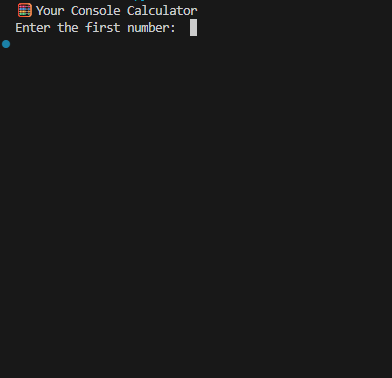

# 🧮 Console Calculator (Python)


### 🎞️ Program Demo




## 📑 Table of Contents

- [📘 Overview](#-overview)
- [📖 Explanation](#-explanation)
- [🚀 Technologies Used](#-technologies-used)
- [⚙️ How to Run This Program](#️-how-to-run-this-program)
- [💻 Interact with the Program](#-interact-with-the-program)
- [📜 License](#-license)
- [📎 Resources](#-resources)
- [🔮 Future Improvements](#-future-improvements)

---

## 📘 Overview
A simple and interactive calculator that runs in the terminal.  
It allows users to perform basic arithmetic operations repeatedly in a friendly menu-based interface.

---

## 📖 Explanation

### ✅ Project Description
This is a beginner-friendly console calculator built with Python.  
The program takes two numbers from the user and performs one of four operations:

- **Addition**
- **Subtraction**
- **Multiplication**
- **Division**

It includes error handling, prevents division by zero, and allows users to continue performing calculations without restarting the program.

---

### ✨ Features
- ➕ Add numbers  
- ➖ Subtract numbers  
- ✖️ Multiply numbers  
- ➗ Divide numbers (division by zero protected)  
- 🔁 Repeat calculations in a loop  
- ✅ Error handling for invalid input  
- 💬 User-friendly terminal interface  

---

## 🚀 Technologies Used
- **Python 3.10+ (tested on Python 3.14 Pre-release)**
- **Visual Studio Code**

---

## ⚙️ How to Run This Program

```
📁 Project Structure:

console-calculator/
│-- console-calculator.py        → Main console calculator
│-- README.md                    → Documentation (this file)
```

1. (Optional) Check Python version.
```
python --version
```

2. Navigate to the folder:
```
   cd console-calculator

```
3. Run the program:
```
python console-calculator.py
```

---

## 💻 Interact with the Program

When executed, the program will:

1. Ask for two numbers
2. Show the operation menu:

- 1 → Add
- 2 → Subtract
- 3 → Multiply
- 4 → Divide

3. Display the result
4. Do you want to do another calculation? (y/n)
```
🔎 EXAMPLE

Enter the first number: 10
Enter the second number: 5
Now, choose an option from 1 to 4: 4
The result of the division is: 2.00
Do you want to do another calculation? (y/n): n
Ok. Goodbye!
```
---

## 📜 License

This project is licensed under the MIT License — feel free to use, modify, and share it.

---

## 📎 Resources
- [View the Full Repository on GitHub](https://github.com/elkinvenegas/console-calculator)


## 🔮 Future Improvements

- Add support for floating point formatting precision
- Add option to save calculation history
- Add unit tests for each operation
